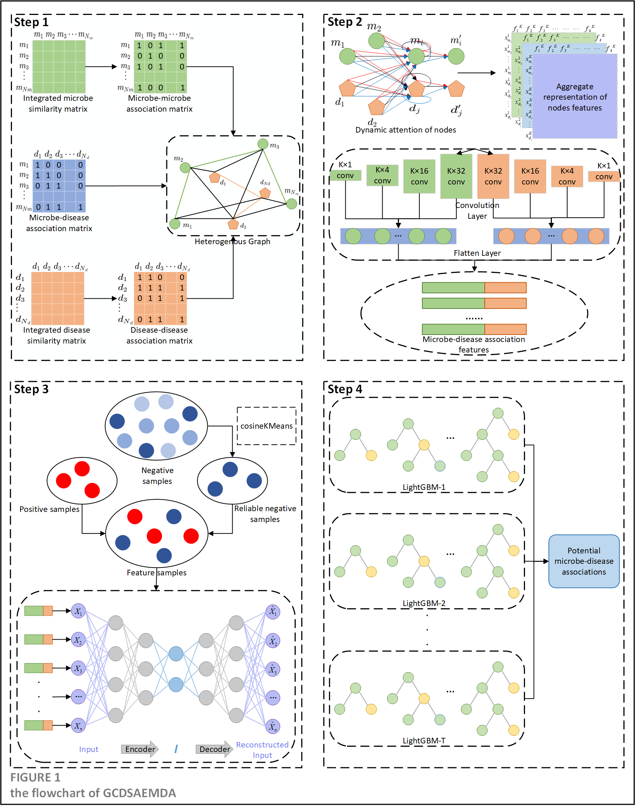

# GCDSAEMDA

Microbe and disease association prediction based on graph attention convolutional neural network and cosine k-means clustering autoencoder.

## Download and configure

```python
git clone https://github.com/chenyunmolu/GCDSAEMDA.git
cd GCDSAEMDA
pip install -r requirements.txt
```

## Environmental requirements

Install python3 for running this code（Python 3.6 myself）. And these packages should be satisfied:

- numpy~=1.19.2
- pandas~=1.1.5
- pytorch~=1.10.2
- pytorch-cuda~=11.8
- dgl~=1.0.1.cu116
- tensorflow~=2.6.2
- keras~=2.6.0
- lightgbm~=4.3.0
- scikit-learn~=0.24.2
- scipy~=1.5.2
- xlsxwriter~=3.2.0
- matplotlib~=3.3.4

## Dataset

The dataset comes from [HMDAD](https://www.cuilab.cn/hmdad) and [Disbiome](https://disbiome.ugent.be/home).

## Input file

- `mircobe_disease_association_matrix.csv`：The correlation matrix between microbes and diseases，The first column represents the various names of microorganisms, and the first row represents the various names of diseases. In addition, the intersection of the rows and columns corresponding to microorganisms and diseases is 1, indicating a known association, and 0, indicating an unknown association
- `disease_do_similarity.csv`：The semantic similarity matrix of diseases, the DOID of diseases is obtained from [Disease Ontology](https://disease-ontology.org/) and calculated using the R package DOSE
- `disease_name_doid.csv`：Contains the name and DOID corresponding to the disease，the DOID of diseases is obtained from [Disease Ontology](https://disease-ontology.org/) and calculated using the R package DOSE
- `disease_GIP_similarity.csv`：Disease Gaussian Interaction Profile Kernel (GIP) similarity matrix
- `disease_similarity_fusion_matrix.csv`：A comprehensive similarity matrix that integrates disease semantic similarity and GIP similarity
- `microbe_functional_similarity.csv`：The functional similarity matrix of microorganisms is calculated based on the correlation matrix and disease semantic similarity matrix
- `microbe_GIP_similarity.csv`： Microbe Gaussian Interaction Profile Kernel (GIP) similarity matrix
- `microbe_similarity_fusion_matrix.csv`：A comprehensive similarity matrix that integrates microbial functional similarity and GIP similarity
- `HMDAD.xlsx/Disbiome.xlsx`：The original correlation data downloaded from HMDAD/Disbiome, after removing duplicate data, can obtain the correlation matrix between microorganisms and diseases

**When you want to run your own data, you have to replace the above files.**

## Running files

- `Prepare_data.py`:  To calculate the functional similarity, GIP similarity, and disease GIP similarity of microorganisms, and thus derive the comprehensive similarity matrix between microorganisms and diseases, it is necessary to calculate the semantic similarity of diseases in advance.
- `GAT_CNN.py:`  Building heterogeneous graphs, multi head dynamic graph attention mechanisms, and feature aggregation modules for convolutional neural networks with different sizes of convolutional kernels.
- `GCDSAEMDA_HMDAD.py/GCDSAEMDA_Disbiome.py`:  Negative MDA selection, deep sparse autoencoder dimensionality reduction, lightgbm classification.
- `DASE_Keras.py`:  deep sparse autoencoder model 、negative MDA selection method  and ROC(PR) curve drawing method 

## Run in HMDAD or Disbiome

To run the model, default 5 fold cross validation

```python
arguments:
  --cv: Three kinds of cross validation.

example:
  Run cv3 in the HMDAD database:
    python GCDSAEMDA_HMDAD.py --cv 3 
  Run cv2 in the Disbiome database:
    python GCDSAEMDA_Disbiome.py --cv 2 
```

## The flowchart of GCDSAEMDA


